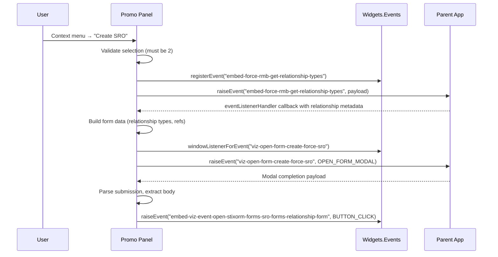
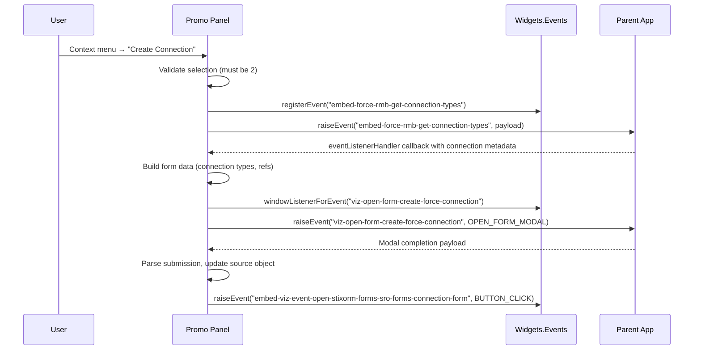
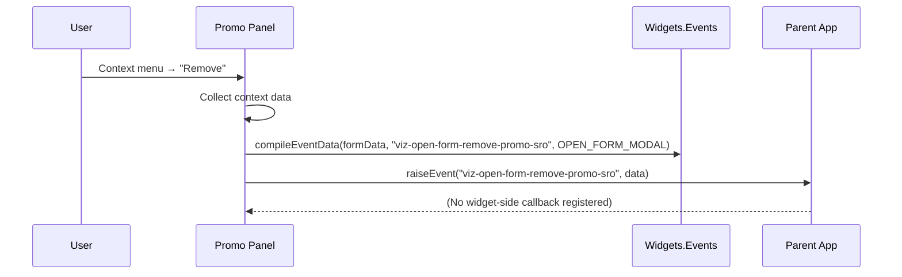

# Promo Panel Menu Event Flow

## Overview
This document traces the complete lifecycle of the Promo panel context menu options defined in `src/js/panel.promo.js`. Each section outlines:

- Preconditions that enable the option.
- Events raised towards the parent host.
- Callback hooks and data transformations performed inside the widget.
- Downstream actions triggered after modal submission.

All flows assume widget mode; local mode behaviour is limited to selection validation and logging.

## Shared Prerequisites
- The menu is registered via `simpleContextMenu` against the Promo SVG element during `Widgets.Panel.Promo.init`.
- `panelUtilsNs.contentMenuItem` must be set for menu visibility.
- For “Create SRO” and “Create Connection”, exactly two graph elements must be selected (`panelUtilsNs.selection.count() === 2`).
- Events are compiled through `eventsNs.compileEventData`, guaranteeing a standard envelope with `type`, `payload`, `action`, `componentId`, and `config` fields.

## Flow: Create SRO

### Sequence Diagram

### Detailed Steps
1. **Selection validation**  
   - Uses `panelUtilsNs.selection.list` to clone the selected source and target; also copies their `.original` data for API compatibility.
2. **Relationship metadata request**  
   - Calls `ns.getForceRMBGetRelationshipTypes`, which registers `eventsNs.registerEvent(eventName, eventsNs.eventListenerHandler, callbackFn)` before raising `embed-force-rmb-get-relationship-types`.
3. **Modal preparation**  
   - Callback packages `relationship_type_list`, `source_ref`, and `target_ref` into `dataForForm`.
4. **Open modal**  
   - `ns.formOpenCROLink` attaches a one-off `window` listener for `viz-open-form-create-force-sro` then raises the `OPEN_FORM_MODAL`.
5. **Modal completion**  
   - Completion callback parses `payload.payload.payload.body` (string or object) and forwards it with the original selection data to `ns.formOpenCRO`.
6. **Final action**  
   - `ns.formOpenCRO` builds a `BUTTON_CLICK` event with form metadata (form ID, group, family) and raises `embed-viz-event-open-stixorm-forms-sro-forms-relationship-form`.

## Flow: Create Connection

### Sequence Diagram

### Detailed Steps
1. **Selection validation and cloning** identical to the SRO path.
2. **Connection metadata request**  
   - `ns.getForceRMBGetConnectionTypes` raises `embed-force-rmb-get-connection-types` and registers the callback before emission.
3. **Modal preparation**  
   - Callback produces `dataForForm` with `connection_type_list`, `connect_objects.source_ref`, and `connect_objects.target_ref`.
4. **Open modal**  
   - `ns.formOpenConnectionLink` registers a window listener for `viz-open-form-create-force-connection` and raises the form event.
5. **Modal completion**  
   - Callback parses the nested payload and invokes `ns.formOpenConnection`.
6. **Target injection logic**  
   - `ns.formOpenConnection` reads `connection_field_list` from the form data, attempts to insert the target ID into the cloned source object (supports single or inferred multi-value fields), then raises `embed-viz-event-open-stixorm-forms-sro-forms-connection-form` with `BUTTON_CLICK`.

## Flow: Remove

### Sequence Diagram

### Detailed Steps
1. **Context capture**  
   - Pulls `panelUtilsNs.getContentMenuData()` into `formData`. No selection count requirement.
2. **Compile and raise event**  
   - Builds an `OPEN_FORM_MODAL` payload (`formId = "remove-promo-sro"`) and raises `viz-open-form-remove-promo-sro`.
3. **Parent ownership**  
   - No callback is registered; confirmation, removal logic, and any follow-up notifications are handled entirely by the parent host.

## External Dependencies & Assumptions
- **eventsNs.registerEvent / windowListenerForEvent** provide lifecycle management for parent responses. The caller must ensure callbacks are idempotent; neither helper automatically unregisters.
- **panelUtilsNs.selection** is expected to expose `.list`, `.count()`, and per-item `.data` / `.data.original` structures.
- **Parent host** is responsible for:
  - Serving modal HTML for the `viz-open-form-*` events.
  - Returning structured payloads with `payload.payload.payload.body`.
  - Sending follow-up events after the user submits or cancels modals.
- **Error handling** currently logs to the console; no toast notifications are fired when preconditions fail or callbacks receive unexpected shapes.

## Suggested Enhancements
- Add runtime guards for `connection_field_list` to avoid `.match` and `.push` errors when malformed form responses arrive.
- Provide user-facing feedback (e.g., toast via `panelUtilsNs.showNotification`) if requirements such as a two-item selection are not met.
- Consider unbinding modal listeners once responses are processed to prevent duplicate handling on successive form launches.

