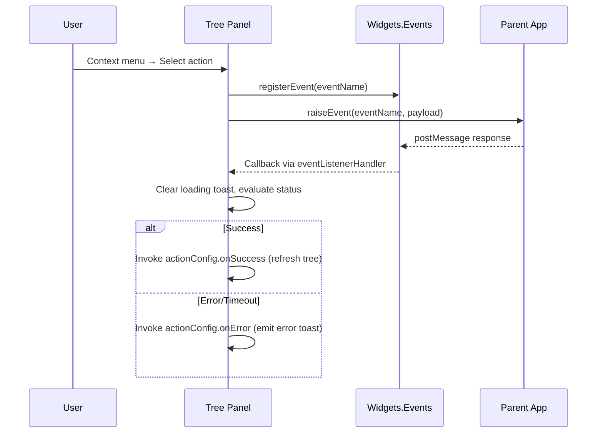

# Tree Panel Menu Event Flow

## Overview
This document mirrors the promo-panel flow reference and explains how the tree panel context-menu actions (`Copy`, `Edit DAG`) operate end-to-end. It covers:

- Preconditions and selection requirements
- Events raised and callbacks registered
- Parent response handling and refresh triggers
- Notification behavior and fallback handling

## Shared Prerequisites
- Tree menu items are defined in `src/js/panel.tree.js` under `ns.menuItems`.
- Context-menu display is controlled by `panelUtilsNs.contentMenuItem`; items appear only when a tree node has focus.
- A single node selection is sufficient (unlike promo, which requires two). The selected node data is stored on the menu context via `panelUtilsNs.contextmenu`.
- The helper `ns.executeTreeMenuAction` (same file) performs the generic workflow: collecting context, sending the event, listening for parent responses, and invoking configured success/error hooks.
- Events are compiled through `eventsNs.compileEventData`, keeping the payload format consistent with other widget actions.

## Action Flow

### Create Copy
- **Event**: `embed-tree-copy`
- **Action steps**:
  1. Selection validation ensures a context node exists (extracted via `panelUtilsNs.contentMenuData`).
  2. Node metadata is flattened to a serializable payload (`id`, `name`, `type`, `data`).
  3. `ns.executeTreeMenuAction` raises `embed-tree-copy`, registers a one-shot listener with `eventsNs.registerEvent`, and shows a loading toast.
  4. On parent success response, the shared handler dismisses the loading toast, shows “Tree node copied successfully,” and calls the `onSuccess` hook defined in `ns.treeMenuActionConfig.copy`—which refreshes the tree.
  5. On timeout or error, `onError` fires with the error detail, allowing future customization (e.g. additional toast logging).

### Edit DAG
- **Event**: `embed-tree-edit-dag`
- **Action steps** are identical to Copy, except the `successMessage` and event name differ. The `onSuccess` hook also refreshes the tree view via the last-used filter type.

## Sequence Diagram
This flow applies to both actions (Copy/Edit DAG); the messages listed align with `executeTreeMenuAction`.

## Response Handling Logic
`src/js/panel.tree.js`, `ns.executeTreeMenuAction`:

- The shared `responseHandler` introspects `response.payload.status`. Recognized statuses:
  - `"success"` → success toast + `onSuccess` hook.
  - Any other status → error toast + `onError`.
- Timeout fallback is triggered if the parent never responds within 15 seconds; this surfaces an error toast and routes through `onError`.
- Since `onSuccess` / `onError` are defined per-menu-item in `ns.treeMenuActionConfig`, each can provide custom follow-up behavior without modifying the helper.

## Notifications
- Loading: `"Copying tree node..."` or `"Editing DAG..."`, displayed immediately.
- Success: `"Tree node copied successfully"` or `"DAG updated successfully"`.
- Error: Timeout or parent-provided message (from `payload.message`); the helper defaults to event-specific error text if no message is provided.

## Refresh Behavior
- `ns.currentTreeType` tracks the last filter selection via `ns.updateTree`.
- On success, both actions call `ns.refreshTreeAfterMenuAction(currentType)` through their `onSuccess` hooks.
- `refreshTreeAfterMenuAction` simply calls `ns.updateTree(treeType)`, ensuring the view reflects the latest state.
- If a future menu action should not refresh, its `onSuccess` hook can be redefined accordingly (or the config can pass a no-op).

## Extensibility Notes
- To add new tree menu actions:
  1. Add a new entry in `ns.treeMenuActionConfig` with `eventName`, messaging, and optional `onSuccess`/`onError` hooks.
  2. Add a corresponding entry in `ns.menuItems` that calls `ns.executeTreeMenuAction` with the new config.
  3. Ensure the parent application emits a response with `payload.status` and optional `payload.message`.
- If per-action callbacks require additional data, extend the payload structure in `executeTreeMenuAction` (e.g., include `contextData.data.original` fragments) before raising the event.

## Related Files
- Tree panel logic: `src/js/panel.tree.js`
- Events namespace: `src/js/#events.js`
- Shared utilities (notifications, selection, context menu): `src/js/panel._utils.js`
- Documentation counterpart for promo panel: `PROMO_PANEL_MENU_EVENT_FLOW.md`

