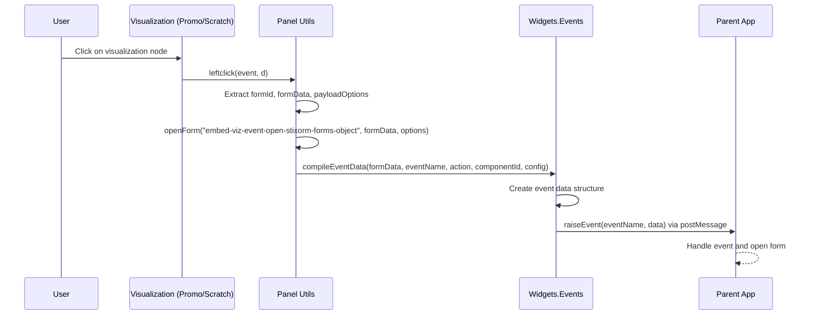

# Visualization Object Click Event Flow

## Overview
This document describes the complete lifecycle of what happens when a user clicks on an object in the visualization (VIZ). The flow covers:

- How click events are attached to visualization nodes
- The click handler processing logic
- Event compilation and raising mechanism
- Communication with the parent application via postMessage

The event `embed-viz-event-open-stixorm-forms-object` is raised to the parent application when any object in the Promo or Scratch visualization panels is clicked.

## Event Flow Diagram



## Detailed Flow

### 1. Event Attachment

Visualization nodes in both the **Promo Panel** and **Scratch Panel** have click event listeners attached during graph rendering:

**Promo Panel** (`src/js/panel.promo.js`):
```644:644:src/js/panel.promo.js
            .on('click', panelUtilsNs.leftclick)
```

**Scratch Panel** (`src/js/panel.scratch.js`):
```261:261:src/js/panel.scratch.js
            .on('click', panelUtilsNs.leftclick)
```

Both panels attach the same click handler: `panelUtilsNs.leftclick` from `src/js/panel._utils.js`.

### 2. Click Handler Execution

When a node is clicked, `leftclick` is invoked with the D3 event and node data:

```289:372:src/js/panel._utils.js
    ns.leftclick = function(event, d) {
        console.group(`Widgets.Panel.Utils.leftclick on ${window.location}`);
        console.log("leftclick event->", event);
        console.log("leftclick d->", d);

        try {

            //raise event to load form for this content
            try {
                const formId = "embed-viz-event-open-stixorm-forms-object"; //d.type
                const formData = d.original;
                //read config from node
                const payloadOptions = {
                    "object_family": d.object_family,
                    "object_form": d.object_form,
                    "object_group": d.object_group,
                }
                if (formId) {
                    console.log('open form for type', formId, formData, payloadOptions)
                    ns.openForm(formId, formData, payloadOptions);
                }
            } catch (e) {
                console.error('could not get for type from Node', e);
            }
        
            const selected = d3.select(this)
            const id = d.id;
            const data = {
                id: id,
                element: selected,
                data: d,
                event: event,
            }

            const isAlreadySelected = ns.selection.has(id);

            console.log("isAlreadySelected->", isAlreadySelected);

            //unselect me if already selected
            if (isAlreadySelected) {
                ns.selection.remove(id, data);
                selected.classed("select-source", false);
                selected.classed("select-target", false);
                selected.classed("select-other", false);
            } else {
                //add me to selection and get back anything that was removed
                const removedData = ns.selection.add(id, data);
                // if we have removed data, then we need to deselect it
                const removedId = removedData ? removedData.id : null;
                if (removedId !== null) {
                    const removedElement = removedData.element;
                    removedElement.classed("select-source", false);
                    removedElement.classed("select-target", false);
                    removedElement.classed("select-other", false);
                }
            }

            //highlight the first item
            const firstItem = ns.selection.getFirst();
            console.log("firstItem->", firstItem);
            if (firstItem) {
                const firstElement = firstItem.element;
                firstElement.classed("select-source", true);
                firstElement.classed("select-target", false);
                firstElement.classed("select-other", false);
            }

            //highlight the last item
            const lastItem = ns.selection.getLast();
            console.log("lastItem->", lastItem);
            if (lastItem) {
                const lastElement = lastItem.element;
                lastElement.classed("select-source", false);
                lastElement.classed("select-target", true);
                lastElement.classed("select-other", false);
            }

        } catch (error) {
            console.error("Error in leftclick", error);
        } finally {
            console.log("leftclick done");
            console.groupEnd();
        }

    }
```

**Key Processing Steps:**

1. **Event Data Extraction**:
   - `formId` is hardcoded to `"embed-viz-event-open-stixorm-forms-object"`
   - `formData` is extracted from `d.original` (the original object data)
   - `payloadOptions` is built from node properties:
     - `object_family`: The object's family classification
     - `object_form`: The object's form type
     - `object_group`: The object's group classification

2. **Form Opening**:
   - Calls `ns.openForm(formId, formData, payloadOptions)` to raise the event

3. **Selection Management**:
   - Manages node selection state (add/remove from selection)
   - Updates visual classes (`select-source`, `select-target`, `select-other`)
   - Highlights first and last selected items

### 3. Event Compilation

The `openForm` function compiles the event data using the event system:

```880:899:src/js/panel._utils.js
    ns.openForm = function(formId, formData, options) {
        console.group(`openForm on ${window.location}`);

        // const payload = {
        //     action: 'click',
        //     id: formId,
        //     type: 'button'
        // }
        const eventName = formId;
        const action = "BUTTON_CLICK";

        console.log("compileEventData", formData, eventName, action, formId, options);

        const data = eventsNs.compileEventData(formData, eventName, action, formId, options);

        console.log(`event raise ${eventName}`, data);
        eventsNs.raiseEvent(eventName, data);
        console.log(`event raised ${eventName}`);
        console.groupEnd();
    }
```

**Event Data Structure:**

The `compileEventData` function creates a standardized event envelope:

```72:80:src/js/#events.js
    ns.compileEventData = (payload, eventName, action, componentId, config, target) => ({ 
        topic: eventName, 
        type: eventName, 
        payload: payload, 
        action: action, 
        componentId: componentId, 
        config: config,
        target: target || "parent"
    });
```

**Resulting Event Structure:**
```javascript
{
    topic: "embed-viz-event-open-stixorm-forms-object",
    type: "embed-viz-event-open-stixorm-forms-object",
    payload: d.original,  // The original object data
    action: "BUTTON_CLICK",
    componentId: "embed-viz-event-open-stixorm-forms-object",
    config: {
        object_family: d.object_family,
        object_form: d.object_form,
        object_group: d.object_group
    },
    target: "parent"
}
```

### 4. Event Raising

The compiled event is raised to the parent application via `raiseEvent`:

```193:209:src/js/#events.js
    ns.raiseEvent = function(eventName, data) {
        console.group(`raiseEvent on ${window.location}`);
        let event = new CustomEvent(eventName, {
          detail: data,
        });
        console.log("event", event);
        console.log("window.parent", window.parent);

        if (window.parent) {
          window.parent.postMessage(JSON.stringify(data), "*");
          console.log("postMessage to parent", data);
        } else {
          window.dispatchEvent(event);
          console.warn("this doc is not in iFrame, dispatchEvent", event);
        }
        console.groupEnd();
    }
```

**Communication Mechanism:**

- **Widget Mode** (in iframe): Sends event to parent via `window.parent.postMessage()` with JSON stringified data
- **Local Mode** (standalone): Dispatches a CustomEvent on the window object

## Event Payload Details

### Form Data (`payload`)
The `payload` contains the complete original object data (`d.original`). This typically includes:
- Object ID
- Object type
- All object properties and attributes
- Relationships and references

### Configuration (`config`)
The `config` object provides metadata about the object:
- **`object_family`**: Classification family (e.g., "stix", "sro")
- **`object_form`**: Specific form type identifier
- **`object_group`**: Grouping classification

### Action
Always set to `"BUTTON_CLICK"` to indicate this is a user-initiated action.

## Parent Application Handling

The parent application should:

1. **Listen for postMessage events** from the iframe
2. **Parse the event data** structure
3. **Check the event type** (`embed-viz-event-open-stixorm-forms-object`)
4. **Extract the payload** (original object data)
5. **Use the config** to determine which form to open
6. **Open the appropriate form** with the object data pre-populated

### Example Parent Handler

```javascript
window.addEventListener("message", function(event) {
    const eventData = JSON.parse(event.data);
    
    if (eventData.type === "embed-viz-event-open-stixorm-forms-object") {
        const objectData = eventData.payload;
        const config = eventData.config;
        
        // Open form based on config
        openForm({
            family: config.object_family,
            form: config.object_form,
            group: config.object_group,
            data: objectData
        });
    }
});
```

## Related Flows

- **Tree Panel Click**: Tree panel nodes use a different event flow (see `src/js/panel.tree.js` line 676)
- **Context Menu Actions**: Right-click context menu actions follow different event patterns (see `docs/PROMO_PANEL_MENU_EVENT_FLOW.md`)
- **Selection Management**: Click events also manage node selection state for multi-select operations

## Code References

- **Click Handler**: `src/js/panel._utils.js` - `leftclick()` function (line 289)
- **Event Opening**: `src/js/panel._utils.js` - `openForm()` function (line 880)
- **Event Compilation**: `src/js/#events.js` - `compileEventData()` function (line 72)
- **Event Raising**: `src/js/#events.js` - `raiseEvent()` function (line 193)
- **Promo Panel Attachment**: `src/js/panel.promo.js` - line 644
- **Scratch Panel Attachment**: `src/js/panel.scratch.js` - line 261

## Notes

- The event name `embed-viz-event-open-stixorm-forms-object` is hardcoded and applies to all visualization object clicks
- The original object data (`d.original`) must be present on the node data structure for the event to include meaningful payload
- Selection state is managed independently of the event raising - the event is raised regardless of selection state
- Error handling is minimal - errors in event raising are logged but don't prevent selection state updates


